<h2><center>HW5：Web搜索引擎 实验报告</center></h2>

<h5><center>2112614 刘心源</center></h5>

# 一、使用环境与工具

python环境：python=3.9.1

网页爬虫：使用Scrapy

文本索引：使用Elasticsearch==7.9.1

Web框架：Django


# 二、使用命令

### 爬虫

进入`blog_spider/blog_spider/spiders`路径下，执行以下命令：
```bash
scrapy crawl blogType
```

爬取网站的所有模块信息并生成每个模块前二十页的url，注意修改设置中的保存文件设置（x

然后执行：

```bash
scrapy crawl blog
```

爬取所有页面url内的所有博客信息，保存到json文件中

### 链接分析

进入`blog_spider/blog_spider/utils`，执行

```
python -u pagerank.py
```

将所有爬取数据进行链接分析，其PR值保存回json中，输出为finaloutput.json

### 构建索引

继续在该目录下输入

```bash
python -u json2es.py 
```

将保存的json文件上传到`elasticsearch`中，并使用`elasticsearch-head`插件检查是否成功上传

### web界面

进入`myweb`的根目录下，执行下面命令，并打开`127.0.0.1:8000`

```bash
python manage.py runserver 
```

如果模型进行了修改，则需要执行下面命令进行更新
```bash
python manage.py makemigrations searchblog      
python manage.py migrate 
```

### 个性化推荐

需要训练模型，在web根目录下执行：
```python
python manage.py train_model 
```


# 三、过程以及代码

### （1）网页爬取

使用Scrapy爬取https://blog.51cto.com网站的每个板块的前二十页内容并生成url，然后读取这些url并进行爬虫（`blog.py`），下面是部分重要代码：

```python
#blog.py
  def parse(self, response):
        with open('/Users/liuvivian/Blog_Search_Engine/blog_spider/blog_spider/spiders/blogtype.json', 'r', encoding='utf-8') as f:
            data = json.load(f)
        #分批读取data，先读取10个
        for i in data[0:68]:
            print(i);
            if i['TypeUrl'] is not None:
                for url in i['TypeUrl']:
                    self.logger.debug("start to parse url: %s" % url)
                    yield scrapy.Request(url=url, callback=self.parse_article_list, headers=self.headers)

    """
    解析文章列表页面
    """
    def parse_article_list(self, response):
        articles = response.css('div.article-item')
        for article in articles:
            article_url = article.css('a::attr(href)').get()

            # 提取文章摘要内容
            article_abstract = remove_tags(article.css('div.content').get()).strip()
            article_abstract = replace_escape_chars(article_abstract)
            yield response.follow(
                url = article_url,
                callback = self.parse_article_content,
                headers = self.headers,
                meta = {'article_abstract': article_abstract}
            )

    """
    解析文章内容页面
    """
    def parse_article_content(self, response):
        item = BlogSpiderItem()
        # 使用remove_tags处理器去除HTML标签
        item['abstract'] = response.meta['article_abstract']
        item['url'] = response.url
        item['title'] = response.css('h1::text').get()
        item['author'] = response.xpath('//p[@class="clearfix mess-line1"]/a/text()').extract_first()
        content_parts = response.xpath('//div[@class="article-content-wrap"]').getall()
        content = ''.join(content_parts).strip()
        content = replace_escape_chars(content)
        # 清除多余的空白字符
        content = remove_tags(content).strip()
        item['content'] = content
        time_str = response.xpath('//p[@class="clearfix mess-line1"]/time/text()').extract_first()
        if time_str:
            pub_time = datetime.strptime(time_str, '%Y-%m-%d %H:%M:%S')
            formatted_time = pub_time.isoformat()
        item['pubTime'] = formatted_time

        item['relate'] = response.css('div.about-aticle-list a::attr(href)').getall()
        item['urlID'] = get_md5(response.url)
        item['PR'] = 0 #初始化PR
        yield item
```

爬取下来的结果为：（图中PR值是经过下面pagerank计算过了的）
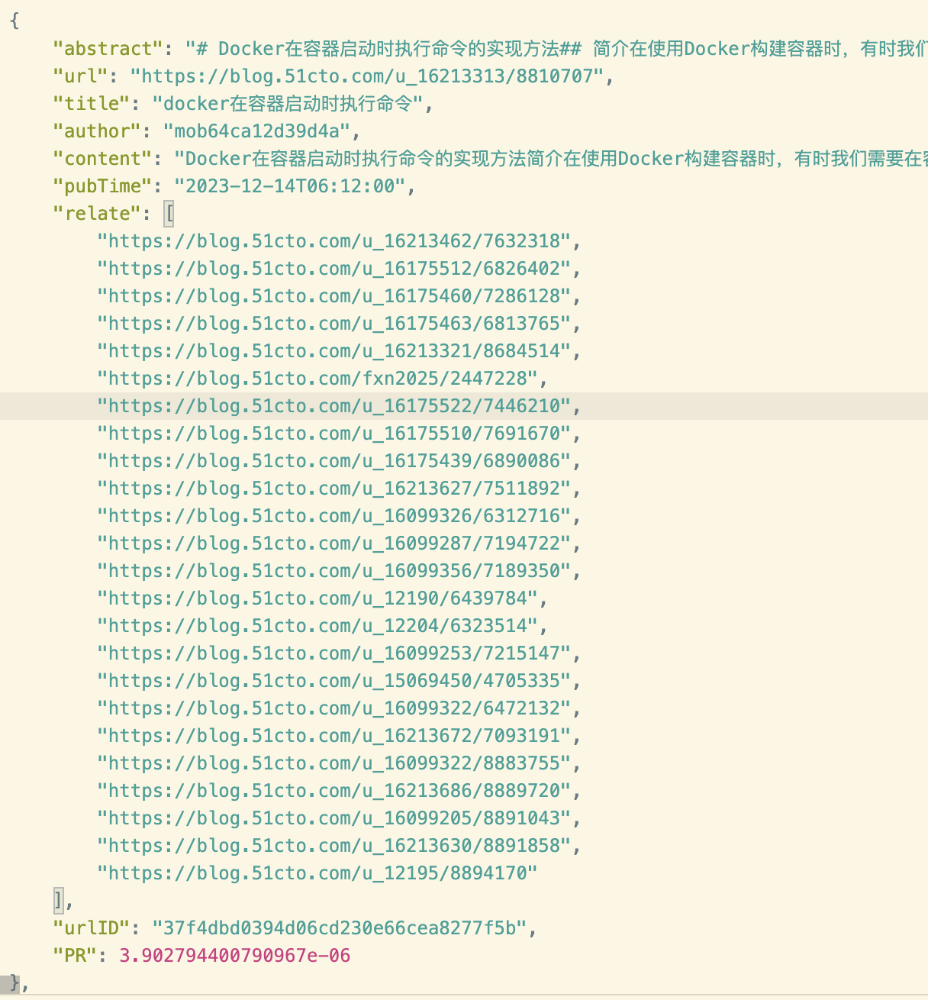


### （2）链接分析 pagerank

PageRank是定义在网页集合上的一个函数，它对每个网页给出一个正实数，表示网页的重要程度，整体构成一个向量，PageRank值越高，网页就越重要，在互联网搜索的排序中可能就被排在前面。

> 摘自维基百科
>
> PageRank是一种链接分析算法，它通过对超链接集合中的元素用数字进行权重赋值，实现“衡量集合范围内某一元素的相关重要性”的目的。该算法可以应用于任何**含有元素之间相互引用的情况**的集合实体。我们将其中任意元素E的权重数值称为“E的PageRank”（The PageRank of E），用符号表示为 PR(E)。其他的因素，类似“作者排名（Author Rank）”同样可以影响到该元素的权重值。
>
> PageRank的结果来源于一种基于图论的数学算法。它将万维网上所有的网页视作节点（node），而将超链接视作边（edge），并且考虑到了一些权威的网站，类似CNN。每个节点的权重值表示对应的页面的重要度。通向该网页的超链接称做“对该网页的投票（a vote of support）”。每个网页的权重值大小被递归地定义，依托于所有链接该页面的页面的权重值。例如，一个被很多页面的链接的页面将会拥有较高的权重值（high PageRank）。
>
> 所以，对于某个页面i，其对应PR值大小的计算公式如下：
>
> 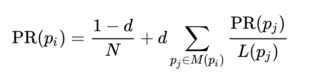
>
> 这里，是目标页面，是链入页面的集合，是页面链出页面的数量，而是集合中所有页面的数量。每个页面的新PageRank值是其从其他页面通过链接获得的PageRank值（考虑到了页面的链接结构）和网页浏览者随机跳转到该页面的概率（考虑到了随机跳转）的组合。”

根据上面的内容，可以编写代码如下：

```python
import numpy as np
import json
def compute_pagerank(nodes, alpha=0.85, iterations=100):
    # 构建URL到ID的映射
    url_to_id = {node['url']: i for i, node in enumerate(nodes)}
    n = len(nodes)
    # 构建初始链接矩阵
    M = np.zeros((n, n))
    for node in nodes:
        node_id = url_to_id[node['url']]
        out_links = node['relate']
        if not out_links:
            # 如果没有外链，认为它链接到所有页面
            M[:, node_id] = 1 / n
        else:
            for link in out_links:
                if link in url_to_id:  # 只考虑列表中的链接
                    linked_node_id = url_to_id[link]
                    M[linked_node_id, node_id] = 1 / len(out_links)

    # 计算PageRank
    teleport = np.ones(n) / n
    r = np.ones(n) / n
    for _ in range(iterations):
        r = alpha * M @ r + (1 - alpha) * teleport
    # 更新节点的PageRank值
    for node in nodes:
        node_id = url_to_id[node['url']]
        node['PR'] = r[node_id]
    return nodes
  
json_file_path = '/Users/liuvivian/Blog_Search_Engine/blog_spider/blog_spider/spiders/output1.json'
try:
    with open(json_file_path, 'r', encoding='utf-8') as file:
        nodes = json.load(file)
    print(nodes[:2])  # 打印前两个节点，作为示例
except FileNotFoundError:
    print(f"文件未找到: {json_file_path}")
except json.JSONDecodeError:
    print(f"JSON文件解析错误: {json_file_path}")

# 计算PageRank值
pageranked_nodes = compute_pagerank(nodes)
json_output_path = '/Users/liuvivian/Blog_Search_Engine/blog_spider/finaloutput.json'
with open(json_output_path, 'w', encoding='utf-8') as file:
    json.dump(pageranked_nodes, file, ensure_ascii=False, indent=4)
for node in pageranked_nodes:
    print(f"URL: {node['url']}, PageRank: {node['PR']}")

```

在`compute_pagerank`函数中实现了`pagerank`算法

- 函数接收三个参数
  - `nodes`：网页节点的列表
  - `alpha`：阻尼因子，默认值为0.85
  - `iterations`：迭代次数，默认值为100。

- 首先建立字典`url_to_id`，将每个节点的url映射到唯一的ID
- 循环遍历每个节点，构建链接矩阵`M`
- 循环迭代100次，`r = alpha * M @ r + (1 - alpha) * teleport` 根据当前的PageRank值`r`、链接矩阵`M`和随机跳转向量`teleport`来更新每个页面的PageRank值。
  - `teleport`：随机跳转向量，其中每个元素的值都是`1/n`。这表示一个网页浏览者随机跳转到任何页面的概率。
  - `r`：PageRank值向量`r`，其中每个页面的初始PageRank值都设置为`1/n`。
- 更新节点中的PR值

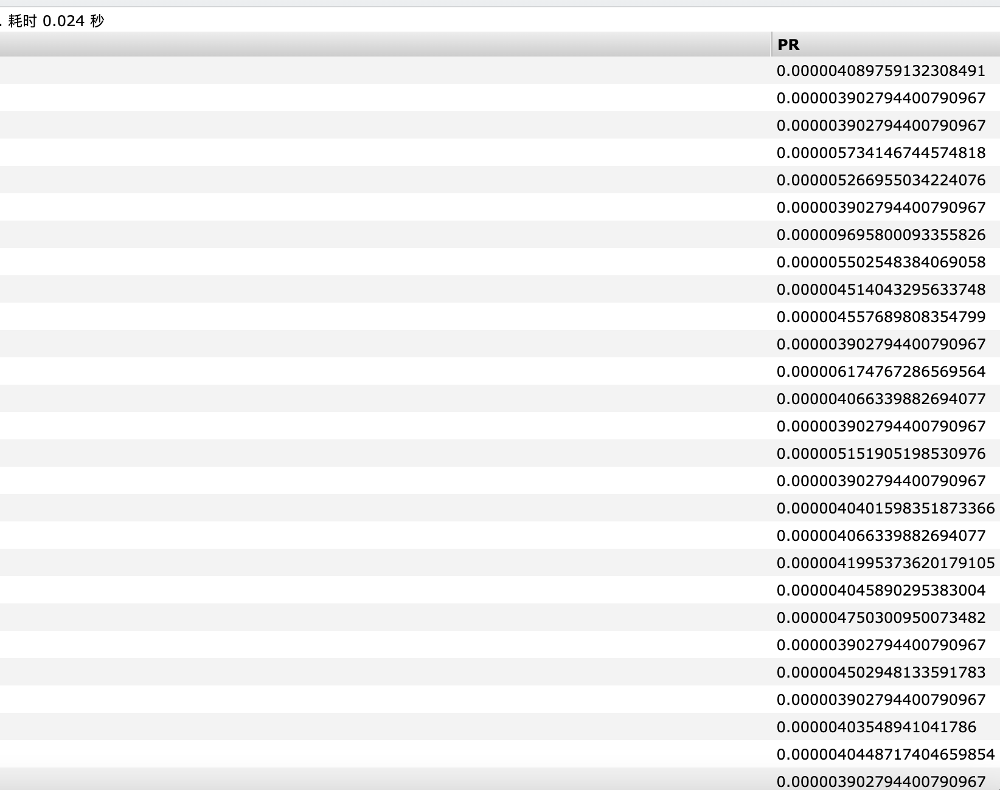


### （3）文本索引 elasticsearch

我们调用`scrapy`和`elasticsearch_dsl`包进行连接，创建索引并上传`json`文件的操作。它们之间有一些接口。

##### 建立连接

```python
from elasticsearch_dsl.connections import connections
# Elasticsearch连接配置
ES_HOST = "127.0.0.1:9200"
connections.create_connection(hosts=[ES_HOST])
```

##### 创建索引

注意`ik_smart`和`ik_max_word`分析器是中文分词器，用于处理中文文本。

```python
# 文档类型定义
class BlogType(Document):
    # Text类型需要分词
    title = Text(analyzer="ik_max_word")
    author = Text(analyzer="ik_smart")
    abstract = Text(analyzer="ik_max_word")
    url = Keyword()
    pubTime = Date()
    content = Text(analyzer="ik_max_word")
    relate = Keyword()
    PR = Double()
    class Index:
        name = 'blog'
        
# 检查索引是否存在，如果存在则删除
index = Index('blog')
if index.exists():
    print("Deleting existing index...")
    index.delete()  # 删除已存在的索引

# 重新创建索引
print("Creating new index...")
BlogType.init() #将BlogType文档类型与之关联。
```

##### 读取数据

```python
# 导入数据到Elasticsearch
def import_to_elasticsearch(data):
    # 检查是否已存在该文档
    search_result = BlogType.search().filter("term", url=data["url"]).execute()
    if search_result.hits.total.value > 0:
        print("Document already exists:", data["url"])
        return
    # 创建文档实例
    blog_doc = BlogType(
        title=data["title"],
        author=data["author"],
        abstract=data["abstract"],
        url=data["url"],
        pubTime=datetime.strptime(data["pubTime"], "%Y-%m-%dT%H:%M:%S"),
        content=data["content"],
        relate=data["relate"],
        PR=data["PR"]
    )
    # 保存文档
    blog_doc.save()
    print("Document added:", data["url"])

# 执行导入操作
for item in data:
    import_to_elasticsearch(item)
```

这个操作其实emmm...不如直接爬虫的时候使用`scrapy`的管道`pipeline`传输...

但是为了`pagerank`我当时只想到这么写呜呜呜呜呜

导入完成之后可以使用`Elasticsearch-head`插件查看导入数据以及情况：

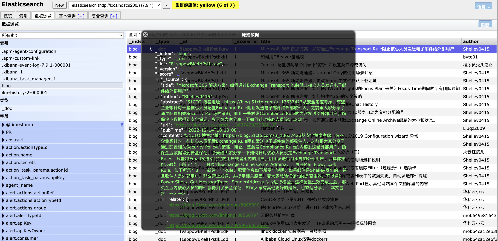

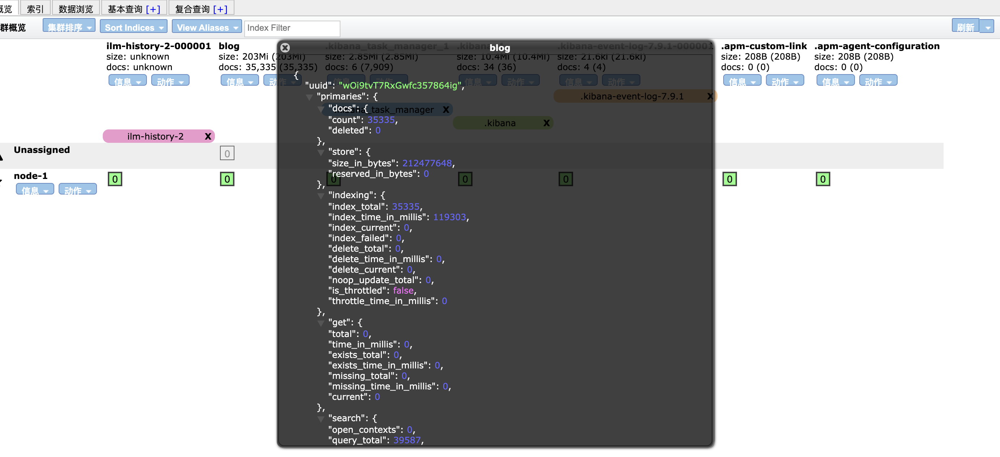


### （4）web框架实现

使用Django框架实现web页面

##### 登录页面


##### 注册页面


##### 查询页面


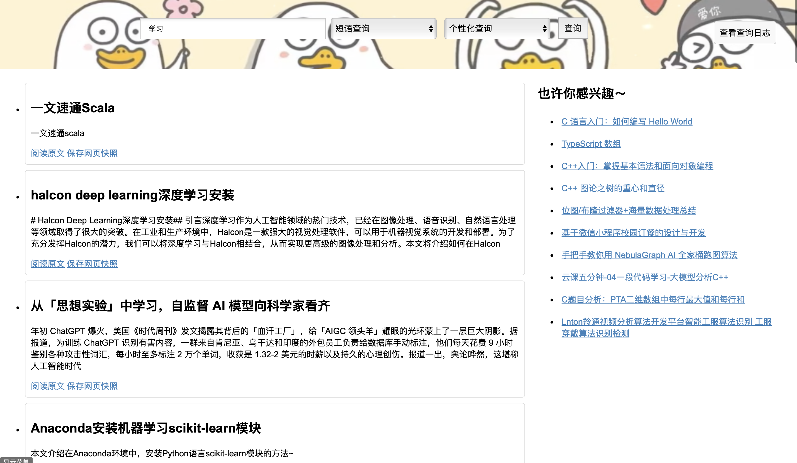


##### 查询日志页面

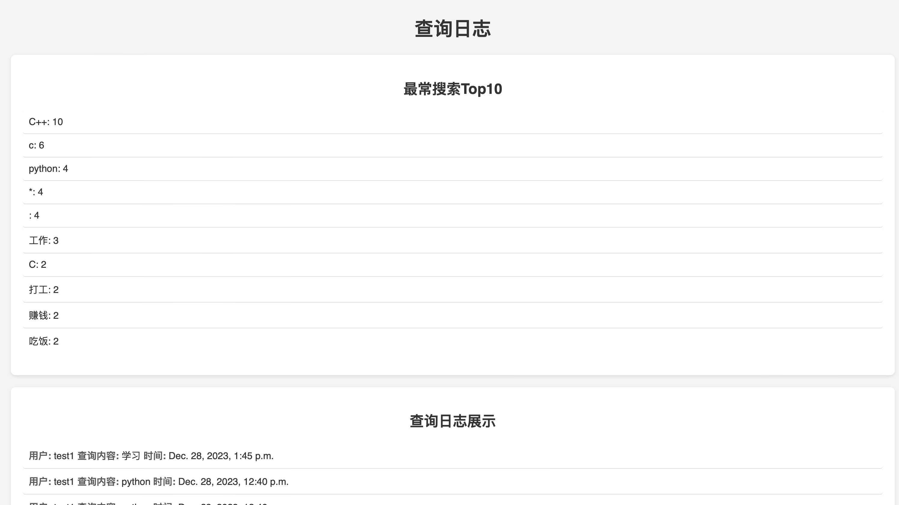

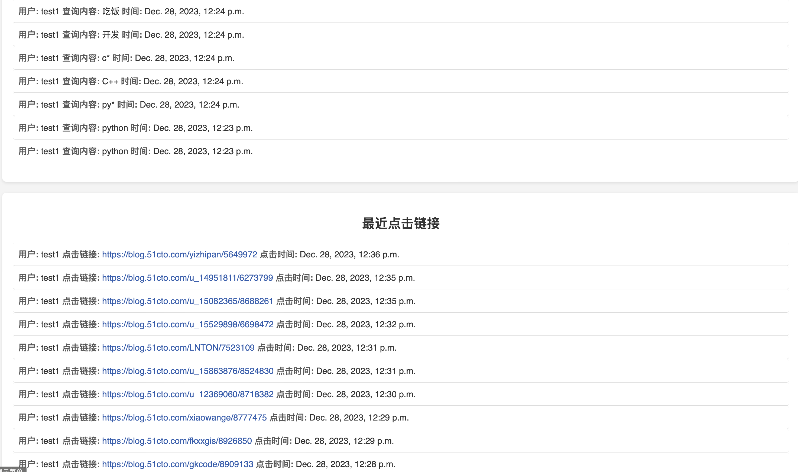


### （5）查询服务

##### 站内查询

```python
def standard_search(query, user=None, size=10000, sort_by='pagerank_only'):
    # 基础查询
    base_query = Q("multi_match", query=query, fields=[
        'title^5',     # 标题字段，权重为5
        'content',     # 内容字段，权重默认为1
        'author^2',  # 作者字段，权重为2
        'abstract^3'     # 摘要字段，权重为3
    ])
    #中间代码是个性化查询部分的
		......
		# 如果选择PR排序或用户未登录
    else:
        s = Search(index='blog').query(base_query)
        s = s.sort({'PR': {'order': 'desc'}}, {'_score': {'order': 'desc'}})
    s = s[:size]
    response = s.execute()
    return list(response)
```

- `Q` 是 Elasticsearch DSL (Domain Specific Language) 的一个组件，用于构建查询。Elasticsearch DSL 是一个用于与 Elasticsearch 交互的 Python 库，它提供了一种更为直观、符合 Python 风格的方式来构建 Elasticsearch 的查询。
- `base_query`是使用`multi_match`查询在多个字段中搜索用户输入的查询词的一个查询对象；
  - `title^5` 表示标题字段（`title`）的权重是5；
  - `author^2` 表示作者字段（`author`）的权重是2；
  - `content`表示内容字段（`content`）的权重保持默认；
  - `abstract`表示摘要字段（`abstract`）的权重是3
  - 权重的体现是通过影响搜索结果中每个文档的相关性得分（`_score`）来实现的。相关性得分是一个数字，表示每个文档与搜索查询的匹配程度。当为查询的一部分指定了一个较高的权重，Elasticsearch 会在计算相关性得分时考虑这个权重，使得匹配该部分的文档获得更高的得分
- 使用`Search`构建上面的查询，通过 `.query()` 方法，将之前的`base_query`添加到搜索中，使用`.sort()`按照先PR值再`_score`进行降序排序；
- 使用`.execute()`将构建好的查询发送到 Elasticsearch 服务器，并等待服务器返回结果。将返回结果保存到`response`中

效果展示：

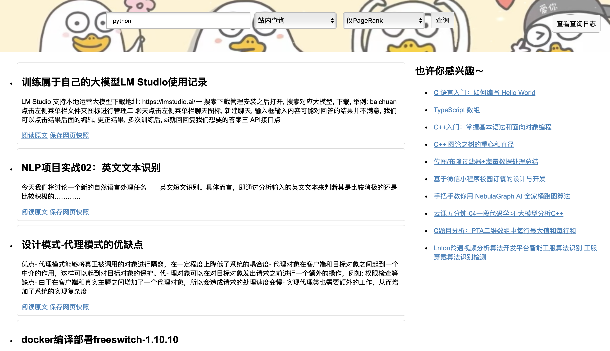


##### **短语查询**

与上面过程类似

```python
# 短语查询
def phrase_search(query, user=None, size=10000, sort_by='pagerank_only'):
    base_query = Q('bool', should=[
        Q("match_phrase", title={"query": query, "boost": 2}),  # 标题匹配，权重为2
        Q("match_phrase", content=query)  # 内容匹配，权重默认为1
    ], minimum_should_match=1)
    #中间代码是个性化查询部分的
		......
		# 如果选择PR排序或用户未登录
    else:
        s = Search(index='blog').query(base_query)
        s = s.sort({'PR': {'order': 'desc'}}, {'_score': {'order': 'desc'}})
    s = s[:size]
    response = s.execute()
    return list(response)
```

- 修改`base_query`的类型为`match_phrase`（短语匹配），并建立一个`bool`查询，组合标题和内容进行查询，`minimum_should_match=1`表示两者中至少有一个应该匹配
  - 标题查询：在 `title` 字段中搜索与 `query` 相匹配的短语，`"boost": 2` 表示这个查询条件的权重是标准权重的两倍。如果文档的标题与查询短语匹配，它在搜索结果中的得分会更高。
  - 内容查询：在 `content` 字段中搜索与 `query` 相匹配的短语。这个查询使用默认权重1，所以它对搜索结果的影响小于标题查询。

- 短语查询要求查询中的单词在文档中以相同的顺序出现，并且紧密相邻。这意味着，它不仅匹配查询中的单词，还考虑了这些单词的顺序和相邻性。

效果展示：

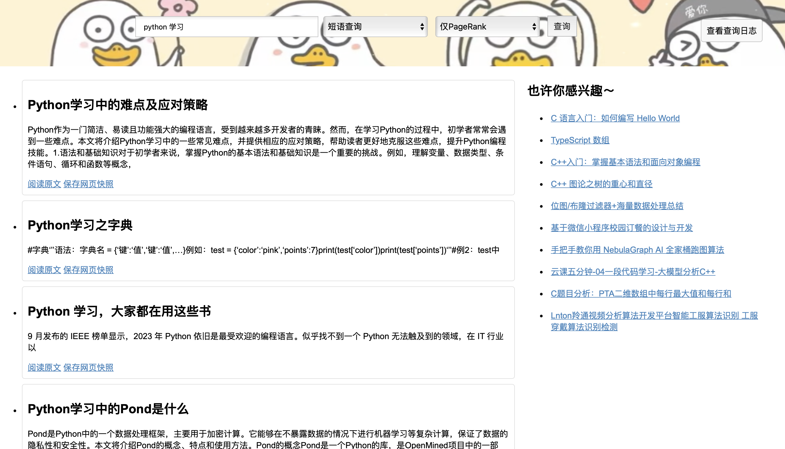


##### 通配查询（正则式）

过程类似，就是将上面的查询的类型换成`wildcard`

```python
# 通配符查询
def wildcard_search(query,user=None, size=10000, sort_by='pagerank_only'):
    base_query = Q('bool', should=[
        Q("wildcard", title={"value": query, "boost": 2}),  # 标题通配符匹配，权重为2
        Q("wildcard", content=query)  # 内容通配符匹配，权重默认为1
    ], minimum_should_match=1)
    #中间代码是个性化查询部分的
		......
		# 如果选择PR排序或用户未登录
    else:
        s = Search(index='blog').query(base_query)
        s = s.sort({'PR': {'order': 'desc'}}, {'_score': {'order': 'desc'}})
    s = s[:size]
    response = s.execute()
    return list(response)
```

- `wildcard`允许在查询字符串中使用通配符。这种查询类型对于模糊匹配特别有用，特别当不确定确切的单词或短语，或者想要匹配一系列类似的单词或短语时。
- 通配符符号
  - `*`：表示任意数量的字符（包括零个字符）。
  - `?`：表示任意单个字符。

效果展示：

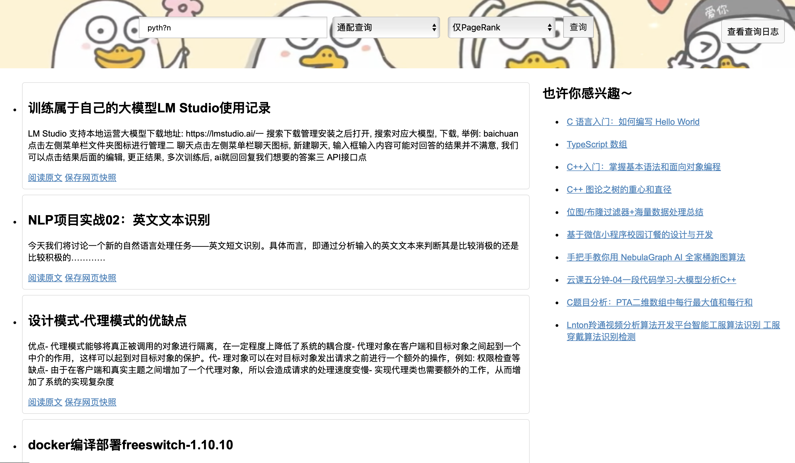


##### 查询日志

设置model记录查询的日志以及点击的链接：
```python
#查询日志的model
class SearchQueryLog(models.Model):
    user = models.ForeignKey(settings.AUTH_USER_MODEL, on_delete=models.CASCADE, null=True, blank=True)
    query = models.CharField(max_length=255)
    timestamp = models.DateTimeField(auto_now_add=True)

    def __str__(self):
        return f"{self.user} searched for {self.query} on {self.timestamp}"

# 查询点击日志
class ClickLog(models.Model):
    user = models.ForeignKey(settings.AUTH_USER_MODEL, on_delete=models.CASCADE)
    url = models.URLField()
    timestamp = models.DateTimeField(auto_now_add=True)

    def __str__(self):
        return f"{self.user} clicked on {self.url} at {self.timestamp}"

```

每次查询的时候都记录

```python
#views.py 
def search_results(request):
  		 .......
       # 如果用户已登录，记录搜索查询日志
        if request.user.is_authenticated:
            SearchQueryLog.objects.create(user=request.user, query=query)
        else:
            SearchQueryLog.objects.create(query=query)
       .......

@login_required
def view_search_logs(request):
    # 获取所有日志条目或根据特定用户筛选
    if request.user.is_superuser:
        logs = SearchQueryLog.objects.all().order_by('-timestamp')
        click_logs = ClickLog.objects.all().order_by('-timestamp')
    else:
        logs = SearchQueryLog.objects.filter(user=request.user).order_by('-timestamp')
        click_logs = ClickLog.objects.filter(user=request.user).order_by('-timestamp')
    # 计算最常搜索的关键词
    queries = logs.values_list('query', flat=True)
    word_count = Counter()
    for query in queries:
        words = jieba.cut(query)
        word_count.update(words)
    most_common_words = word_count.most_common(10)
    return render(request, 'search_logs.html', {
        'logs': logs,
        'most_common_words': most_common_words,
        'click_logs': click_logs 
    })
    
@csrf_exempt
def record_click(request):
    if request.method == 'POST':
        url = request.POST.get('url')
        user = request.user
        if user.is_authenticated:
            # 创建并保存新的点击日志条目
            ClickLog.objects.create(user=user, url=url)
            return JsonResponse({'status': 'success'})
        else:
            return JsonResponse({'status': 'unauthenticated'}, status=401)
    return JsonResponse({'status': 'error'}, status=400)
```

```javascript
function recordClick(url) {
  $.ajax({
    url: '',
    type: 'POST',
    data: {
      'url': url,
      'csrfmiddlewaretoken': '{{ csrf_token }}'
    },
    success: function(response) {
      console.log("Click recorded");
    }
  });
```

编写视图函数以及前端的`Ajax`异步请求进行日志记录，点击主页的“查看查询日志”，查看日志内容：

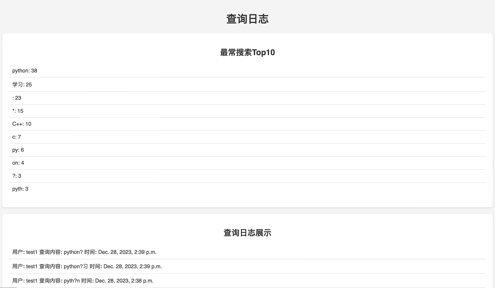

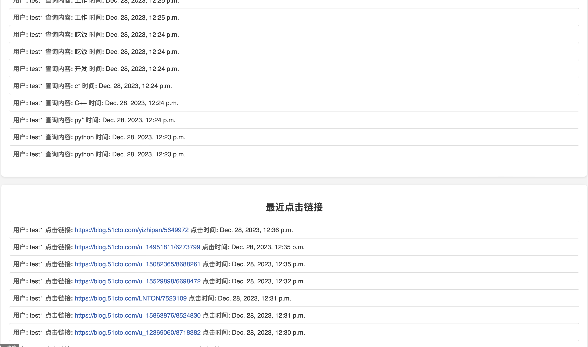

如果希望保存日志在本地文件中，暂时没有实现网页上的保存按钮，在终端进入`myweb`根目录输入：
```bash
python manage.py download_log
```

会执行将数据库中的内容读取并保存到txt文件中：

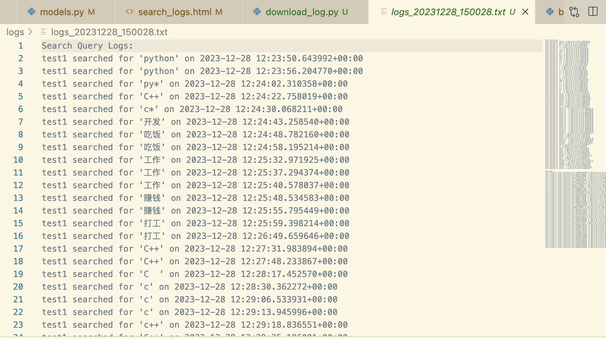


##### 网页快照

在视图中编写函数，并在前端编写ajax请求
```python
#views.py
@csrf_exempt
def take_snapshot(request):
    if request.method == 'POST':
        url = request.POST.get('url')
        # 使用当前时间戳生成快照文件名
        timestamp = datetime.now().strftime('%Y%m%d%H%M%S')
        filename = f'snapshot_{timestamp}.png'
        snapshots_folder = '/Users/liuvivian/Blog_Search_Engine/snapshots'
        snapshot_path = os.path.join(snapshots_folder, filename)

        # 用selenium生成快照
        driver = webdriver.Chrome()
        driver.get(url)
        driver.save_screenshot(snapshot_path)
        driver.quit()

        return JsonResponse({'status': 'success'})
    return JsonResponse({'status': 'error'}, status=400)
```

```javascript
function takeSnapshot(url) {
  $.ajax({
    url: '', 
    type: 'POST',
    data: { 'url': url },
    success: function(data) {
      alert('网页快照保存成功!');
    },
    error: function(error) {
      alert('Error taking snapshot: ' + error);
    }
  });
}
```


生成过程以及效果：

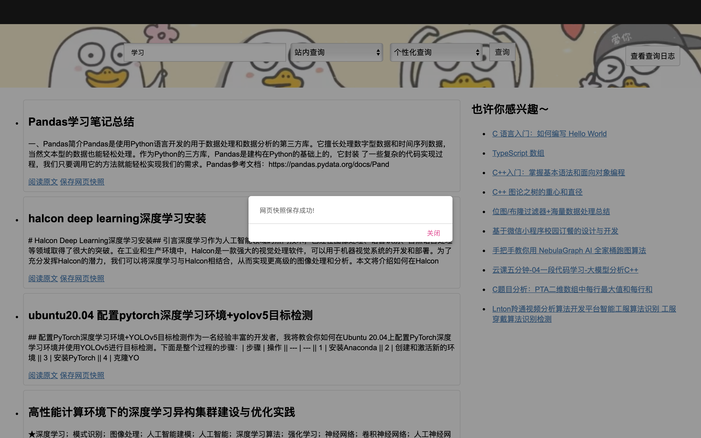

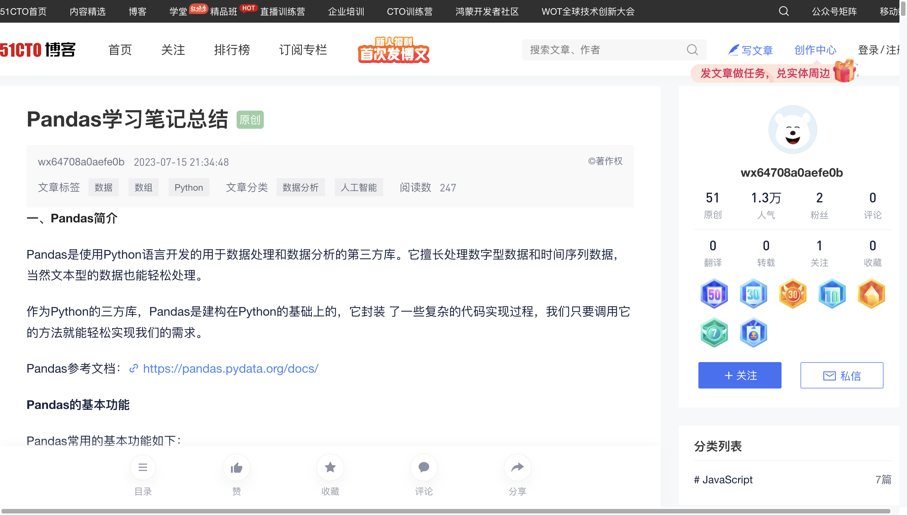


### （6）个性化查询

```python
# 如果选择个性化排序并且用户已登录
if sort_by == 'personalize_search' and user is not None:
  user_profile = {
    'favorite_field': user.favorite_field,
    'occupation': user.occupation
  }
  top_queries = get_top_queries(user)
  print(top_queries)

  # 构建函数评分查询
  functions = []
  if user_profile['favorite_field']:
    functions.append({"filter": Q("term", content=user_profile['favorite_field']), "weight": 2})
    if user_profile['occupation']:
      functions.append({"filter": Q("term", content=user_profile['occupation']), "weight": 2})
      for word in top_queries:
        functions.append({"filter": Q("term", content=word), "weight": 1.5})
        function_score_query = Q(FunctionScore(query=base_query, functions=functions, boost_mode="sum"))
        s = Search(index='blog').query(function_score_query)
        s = s.sort({'_score': {'order': 'desc'}}, {'PR': {'order': 'desc'}})
```

- **构建用户特征**:
  - 从用户模型中提取用户的喜好领域（`favorite_field`）和职业（`occupation`）
  - 使用 `get_top_queries(user)` 函数获取用户最常进行的查询词。
- **构建函数评分查询**：
  - 初始化一个空的 `functions` 列表，用于存储不同的评分函数。
  - 如果用户有喜好领域，添加一个加权函数，当文档的 `content` 字段包含该领域时，给予额外的权重（`weight: 2`）。
  - 如果用户有特定的职业，同样添加一个加权函数，当文档的 `content` 字段包含该职业时，同样增加权重。
  - 对于用户的顶部查询词，为每个词添加一个加权函数，当文档的 `content` 字段包含这些词时，增加较小的权重（`weight: 1.5`）。
- **应用函数评分查询**:
  - 使用 `FunctionScore` 查询结合基础查询（`base_query`）和上述的加权函数，`boost_mode` 设置为 `"sum"` 表示各个函数的分数将被加总。
  - 当执行这个组合查询时，Elasticsearch 首先根据基础查询找到匹配的文档。
  - 然后，对于每个匹配的文档，Elasticsearch 检查所有加权函数的过滤条件是否适用。对于匹配的每个条件，它会根据相应的权重调整该文档的得分。
  - 最后，所有这些得分调整会根据 `boost_mode` 设置被累加到基础查询得分上，得到最终的得分。

效果展示：

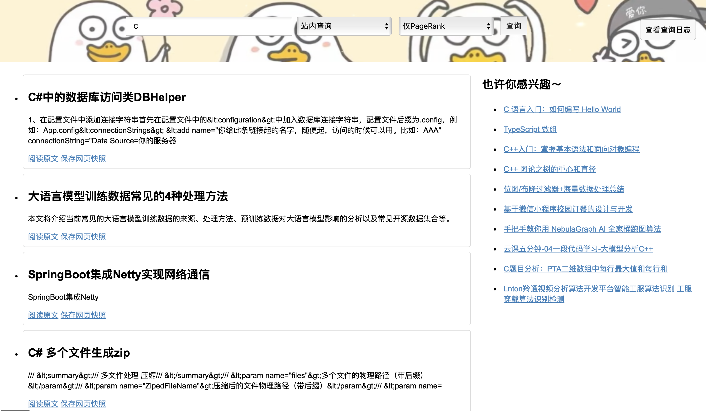

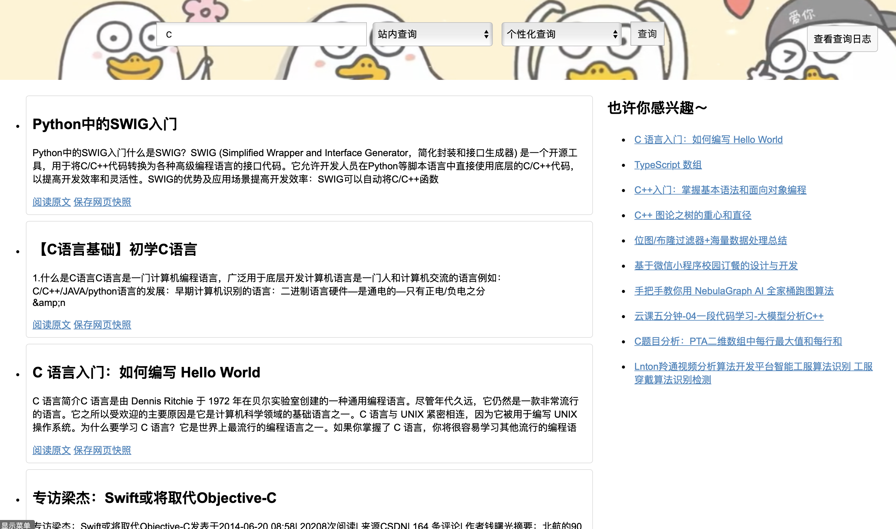

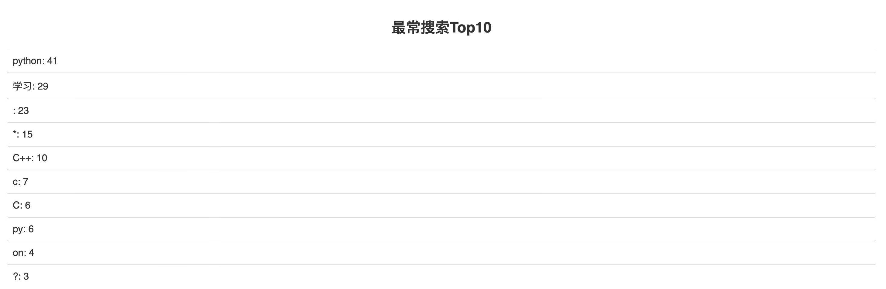

该用户职业填为学生，并且顶部查询词中多次出现“学习”，因此在个性化查询中，“入门”、“基础”偏多。


### （7）个性化推荐

个性化推荐系统使用隐语义模型。

> 隐语义模型又可称为LFM（latent factor model），它从诞生到今天产生了很多著名的模型和方法，其中和该技术相关且耳熟能详的名词有pLSA、 LDA、隐含类别模型（latent class model）、隐含主题模型（latent topic model）、矩阵分解（matrix factorization）。
>
> #### LFM和基于邻域的方法的比较
>
> LFM具有比较好的理论基础，它是一种学习方法，通过优化一个设定的指标建立最优的模型。基于邻域的方法更多的是一种基于统计的方法，并没有学习过程。 
>
> LFM在生成一个用户推荐列表时速度太慢，因此不能在线[实时计算](https://cloud.tencent.com/product/oceanus?from_column=20065&from=20065)。
>
> ItemCF算法支持很好的推荐解释，它可以利用用户的历史行为解释推荐结果。 但LFM无法提供这样的解释。

```python
def build_interaction_matrix(users, links, logs):
  """
  构建用户-链接交互矩阵
  :param users: 用户列表
  :param links: 链接列表
  :param logs: 用户查询日志，形如[(user_id, link_id), ...]
  :return: 交互矩阵，用户和链接的特征映射
  """
  dataset = Dataset()
  dataset.fit(users, links)

  # 构建交互数据
  (interactions, weights) = dataset.build_interactions(logs)

  return interactions, dataset.mapping()

def train_model(interactions):
  """
  训练隐语义模型
  :param interactions: 用户-链接交互矩阵
  :return: 训练好的模型
  """
  # 使用WARP损失函数的LightFM模型
  model = LightFM(loss='warp')
  model.fit(interactions, epochs=30, num_threads=2)
  return model

# 获取所有用户和链接
User = get_user_model()
users = User.objects.all().values_list('id', flat=True)
links = get_all_links_from_es()
# 获取用户点击日志
logs = get_user_interactions()

interactions, mapping = build_interaction_matrix(users, links, logs)
model = train_model(interactions)

with open('recommendation_model.pkl', 'wb') as f:
  pickle.dump(model, f)
  with open('mapping.pkl', 'wb') as f:
    pickle.dump(mapping, f)
```

**过程**

- **构建用户-链接交互矩阵** (`build_interaction_matrix` 函数)
  - 接收用户列表、链接列表和用户的查询日志。
  - 使用 LightFM 的 `Dataset` 类来定义用户和链接的特征空间，并构建一个用户-链接的交互矩阵。这个矩阵表示用户与链接之间的交互（例如点击或浏览）。
  - `dataset.fit(users, links)` 方法用来确定内部特征表示。
  - `dataset.build_interactions(logs)` 方法从提供的日志中构建一个交互矩阵，其中日志是用户与链接之间的交互记录。
- **训练隐语义模型** (`train_model` 函数)
  - 接收用户-链接交互矩阵作为输入。
  - 使用 LightFM 库创建一个模型，指定损失函数为 'warp'（Weighted Approximate-Rank Pairwise）。WARP 损失是一种用于推荐系统的损失函数，它优化了物品的预测排序。
  - 使用交互矩阵训练模型，通过多次迭代（epochs）调整模型参数。
- 获取用户、链接、日志数据并进行训练，将模型保存


**原理**

- 通过用户的历史交互（如点击链接或搜索查询）来了解他们的偏好。
- 利用这些信息训练一个机器学习模型，该模型可以预测用户可能感兴趣的新链接或内容。
- WARP 损失函数帮助模型学习如何对物品进行有效排序，使得对用户更相关的物品排在更前面。
- 结果是一个能够为每个用户提供个性化推荐的系统。


在视图函数中调用:

```python
# 推荐系统
if user:
  # 加载模型和映射
  with open('/Users/liuvivian/Blog_Search_Engine/myweb/recommendation_model.pkl', 'rb') as f:
    model = pickle.load(f)
    with open('/Users/liuvivian/Blog_Search_Engine/myweb/mapping.pkl', 'rb') as f:
      mapping = pickle.load(f)
      # 获取用户和链接的内部id
      # 获取内部映射
      user_id_map, user_feature_map, item_id_map, item_feature_map = mapping
      user_inner_id = user_id_map.get(user.id)
      # 创建物品ID的逆映射
      item_id_inverse_map = {v: k for k, v in item_id_map.items()}
      if user_inner_id is not None:
        # 预测分数并获取前10个推荐
        scores = model.predict(user_inner_id, np.arange(len(item_id_map)))
        top_item_indices = np.argsort(-scores)
        top_items = [item_id_inverse_map[item_id] for item_id in top_item_indices][:10]
        recommendations = top_items
        url_to_title = get_titles_for_urls(top_items)
        print(url_to_title)
```

